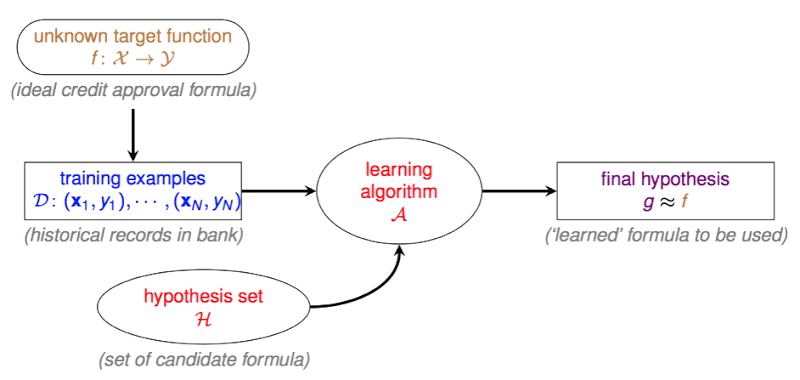
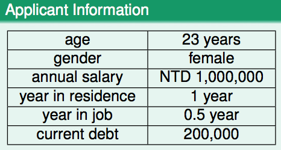
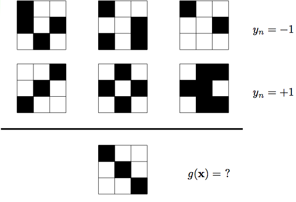
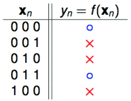
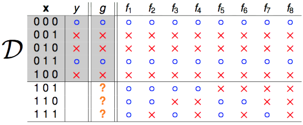
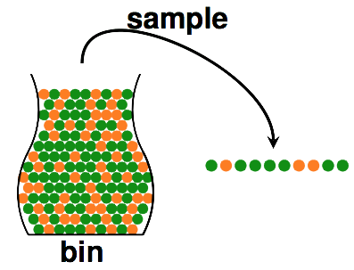
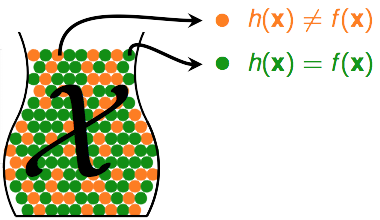
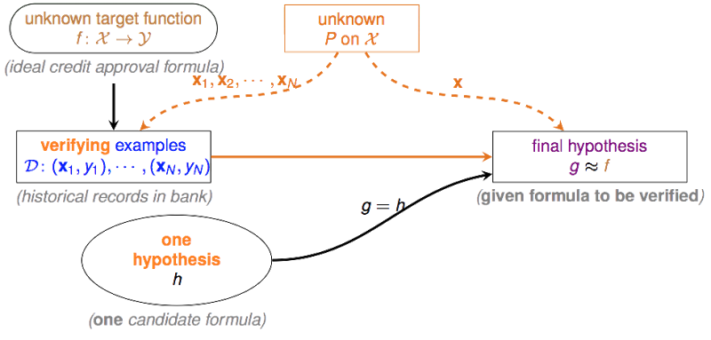

## 机器学习的基础架构 (Learning From Data)

&emsp;&emsp;银行在决定是否要通过贷款申请人的授信请求前，会根据申请人的资料对其进行风险评估，(通常银行会为其计算信用评分)，申请人状况符合银行要求时，银行通过其申请，反之则婉拒。那么银行凭借什么来判断申请人将来是否会违约呢？通过银行之前的信用贷款记录，这些记录中，有些客户发生了违约行为，其他则表现良好，银行从这些违约与非违约的记录中learning到了一些规律，然后利用这些规律，来对新申请人的违约风险进行估计。因此信用评估模型就是一个learning的问题，那么我们该如何使用历史数据做好learning呢？

&emsp;&emsp;下面这张图描述了learning的基础架构：

 - $f:\mathcal{X} \to \mathcal{Y}$，其中$\mathcal{X}$表示输入空间，譬如下图中第一列
 
    ``(age, gender, annual salary, year in residence, year in job, current debt)``

    为输入空间(6维)，而右边一列
    
    ``(23 years, female, NTD 1,000,000, 1 year, 0.5 year, 200,000)``
    
    为该输入空间下的一个向量，每位贷款申请人对应该空间下的一个向量。

    $\mathcal{Y}$表示输出空间，在二元分类中，输出空间是一个1维的取值为+1或-1的空间 $\\{-1,+1\\}^1$，可以用-1表示非违约，+1表示违约。
    $f$是未知的真理，是事物运转的规律，假如我们可以拥有$f$，我们就可以知道一个人到底会不会发生违约行为。但是这个$f$是不可知的，我们无法窥探其中运行的原理(函数内部构造)，我们唯一知道的是$f$在我们已知的历史数据$\mathcal{D}$当中的运行情况(把$x_n$当做$f$输入，把$y_n$当做$f$的输出)，learning要作的事情，就是找一个在$\mathcal{D}$中运行情况与$f$类似的函数，这个函数对于相同的输入，会有与$f$相同的输出，并且希望在$\mathcal{D}$之外，也就是我们未知的世界，我们找的这个函数的运行情况还能与$f$接近。
    
    

 - $\mathcal{D}:(x_1,y_1), \dotsb,(x_N,y_N)$为训练集，该训练集有N笔数据，每笔数据由某申请人在$\mathcal{X}$中的向量和与其对应的类别构成。
 - $\mathcal{H}$，hypothesis set是一个由有限个或无限个方程组成的集合，算法$\mathcal{A}$只能从$\mathcal{H}$的范围内挑选方程。
 
 - $\mathcal{A}$，是一个学习算法，它能够帮助我们在$\mathcal{H}$中找到一个与$f$的判断最接近或足够接近的一个方程。当然我们可以说穷举法是一种学习算法，当$\mathcal{H}$当中candidate formula数量不多时，我们可以用穷举法来寻找。但往往candidate formula数量很大甚至是无穷的，我们就需要设计一个比较好的算法，他能够在较短时间找到我们想要的那个方程。
 
 - $g$，final hypothesis，即$\mathcal{A}$从$\mathcal{H}$中挑选的和$f$判断最接近的那个方程。
 
&emsp;&emsp;说到底，learning在干的事情，就是从hypothesis set里面挑一个“长”的最像$f$的方程$g$，注意前面我的用词是用"它的判断接近$f$"，并不是说$g$和$f$结构很类似，(记住$f$永远是unknown的)，而是说他们的判断很一致，即$f(x)\approx g(x)$。并且这里谈到的接近，是针对训练集$\mathcal{D}$而言的，$\mathcal{D}$之外的数据他们能否表现一致，这才是我们最应该关心的问题，如果$\mathcal{D}$之外他们也能够表现一致，说明我们learning的还不错，我们有从$\mathcal{D}$上面学到东西。这时候换个角度来想，能不能有某个理论，来保证我们的$g$与$f$在$\mathcal{D}$之外也能有差不多的接近程度？

## Learning真的可行吗？ (Is Learning Feasible?)

&emsp;&emsp;图片前两行为training set，对于第一行的所有样本，有$f(x)=-1$，对于第二行的所有样本，有$f(x)=+1$，那么我们能不能通过这6笔数据来猜测一下$f$是长什么样的呢？同学1和同学2利用各自的学习方法分别给出了自己的$g$ 

 - 同学1训练出来的g：
   $g_1(对称图形)=+1$
   $g_1(非对称图形)=-1$
 - 同学2训练出来的g：
   $g_2(左上角为白色的图形)=+1$
   $g_2(左上角为黑色的图形)=-1$

&emsp;&emsp;对于training set中所有样本，有$g_1(x)=g_2(x)=f(x)$，即两个$g_1,g_2$与$f$的表现是一致的，似乎可以认为他们都"学"到了东西，但是对于测试样本来说$g_1(x)=+1,g_2(x)=-1$。真实的$f$我们无法知道，如果他们中的某一个人在所有非训练的资料中也和$f(x)$表现一致，我们才能说他们当中某个人真的学到了东西。但在目前这种情况下，我们无法说同学1学到了东西还是同学2学到了东西。

&emsp;&emsp;让我们再来考虑一个简单的二元分类问题。$\mathcal{X}=\\{0,1\\}^3$，$\mathcal{Y}=\\{\mathrm{o},\times\\}^1$
    

&emsp;&emsp;为何要举这么简单的例子呢？因为前面我们说到真实的$f$是我们无法知道的，但在上面这个简单的例子中，我们有办法把所有可能的$f$全部列举出来。

&emsp;&emsp;可能产生这样的$\mathcal{D}$的$f$只可能有8种并且只有其中的1个是正确的，这样一来，虽然我们可以保证我们的$g$在$\mathcal{D}$上的判断和真实的$f$一致，但我们无法保证在$\mathcal{D}$之外也同样如此。那么这里便值得怀疑一下机器学习的可行性，机器学习到底可不可行？

## 推断未知的世界(Inferring Something Unknown)
&emsp;&emsp;我们知道在前面简单版的learning问题中，由于我们无法推断$\mathcal{D}$之外事情，因此learning不可行。但在其他场景中，我们能否利用$\mathcal{D}$来推断$\mathcal{D}$以外的事情呢？在统计推断中，我们可以利用样本的统计量(statistic)来推断总体的参数(parameter)，譬如使用样本均值来估计总体期望。假设你想了解某一批大米(1000包)的平均重量，可以通过随机抽样抽取一定数量的样本(20包)，用这20包大米的平均重量估计这1000包大米的平均重量，虽然二者并不一定会完全相等，但也不会相差太大，并且你的样本量越大，你得到的统计量与参数之间的误差会越小。在这个例子中，未知的980包大米的平均重量与我们知道的20包大米的平均重量是有关联的，因此我们似乎可以通过$\mathcal{D}$来推断$\mathcal{D}$之外的东西。下面来一个摸球的例子：

 - bin，即总体，假设$P(orange)=\mu$，$P(green)=1-\mu$。但我们无法知道$\mu$到底多大。
 - sample，即样本，数量为$N$，在抽出的$N$个小球中，orange的比例为$\nu$，green的比例为$1-\nu$，数一数就能算出$\nu$

&emsp;&emsp;问题来了，这个$\nu$能不能在一定程度上代表了$\mu$。也许不能，因为即使bin中orange占多数，也可能发生这样的事情，你抽了10个小球出来但全是green的。但这种事情发生的可能性大吗？不大，并且如果我们有更多的样本(抽出更多的球)，则这种事情发生的可能性会越来越小。在概率论中，可以用[Hoeffding's Inequality](http://en.wikipedia.org/wiki/Hoeffding's_inequality)来描述上面那件事情的概率：

$$\mathbb{P}[|\nu-\mu|>\epsilon]\leq 2exp(-2\epsilon ^2N)$$

&emsp;&emsp;注：$\epsilon$是我们的容忍度，当$\mu$与$\nu$的差别小于容忍度时，我们称$\mu$与$\nu$“差不多”(PAC, probably approximately correct)，当$\mu$与$\nu$差别大于容忍度时，我们称$\mu$与$\nu$"差很多"。“差很多”这件事发生的概率越小越好，最大不会超过右边。

&emsp;&emsp;上面这个不等式中，控制右边数值大小的只有$\epsilon ^2$和$N$，$\epsilon ^2$减小(要求降低)与$N$(样本增加)增大都能够使坏事情发生的概率的上限减少。当上限足够小的时候，我们可以说，sample中orange的比例和bin中orange的概率**差不多**，如果sample中的orange比例少，则bin中的orange的比例也会比较少。

&emsp;&emsp;我们可以把learning与抓球这件事结合起来。

&emsp;&emsp;还记得之前说过的$f$吗？他代表未知的真理，而$h(x)是$是属于hypothesis set $\mathcal{H}$的某一个方程。对于某一个向量$x_n$：

 - 如果$h(x_n)\neq f(x_n)$，即他们判断不一致，我们记第n个小球是orange
 - 如果$h(x_n)=f(x_n)$, 即他们判断是一致的，我们记第n个小球是green

&emsp;&emsp;利用之前抓小球的逻辑，我们可以利用sample中orange的比例来推断总体中orange出现的概率，则同样的，我们可以利用sample中$h(x)\neq f(x)$的比例来推断总体中$h(x)\neq f(x)$的概率。这里$h(x)\neq f(x)$表示一个error，则我们可以称 $h(x)$ 在sample中出现error的比例为 $E\_{in}$ (in-sample-error)，在总体中出现error的概率为 $E\_{out}$ (out-of-sample-error)。则对于 $h$ 来说：

 - $E_{out}(h) = \underset{x\sim P}{\epsilon} [h(x)\neq f(x)]$，$\epsilon$表示数学期望

 - $E\_{in}(h) = \frac{1}{N}\sum\_{n=1} ^ {N}[h(x\_n)\neq y\_n]$

&emsp;&emsp;利用Hoeffding's Inequality，我们可以写成：

$$\mathbb{P}[|E\_{in}(h)-E\_{out}(h)|\gt \epsilon]\leq 2 exp(-2\epsilon ^2N)$$

&emsp;&emsp;简单说来，当右边这个“上界”足够小时，我们可以说$h$在sample中的表现(错误率)与$h$在总体中的表现是差不多的。

&emsp;&emsp;注意这里仅仅是说，对于一个固定的$h (fixed h)$而言，$E\_{in}(h)$会与$E\_{out}(h)$很接近，这种情况能说是一种好的learning吗？当然不能，因为如果$E\_{in}(h)$很大，则$E\_{out}$也大，这样是没有意义的。因此我们的算法$\mathcal{A}$要能够自由的从$\mathcal{H}$中挑选方程，我们把$\mathcal{A}$挑选出的最好的$h$称为$g$ (final hypothesis)。因此这里就需要添加一个验证流程(Verification Flow)，这个流程使用历史数据来判断某个$h$够不够好。

## 不幸的状况 (Bad Data)
&emsp;&emsp;前面说到，$\mathcal{A}$要能够自由的在$\mathcal{H}$中挑选它认为最适合的方程，因此这个最适合的方程就有可能是$\mathcal{H}$中的任何一个，有可能是$h\_1$，有可能是$h\_2$，$\mathcal{H}$中任意一个$h$都有可能成为$g$。但我们知道，我们的$\mathcal{D}$只是来自于总体的一个样本 (sample)，既然是sample，就一定会存在抽样误差。譬如你想知道一枚硬币抛出正面的概率是多少，于是你扔了5次，有一定的可能你连续扔了5个正面出来，这时候说抛出正面的概率是1，这样对吗？这当然是行不通的，因此你扔的这5次硬币，就是一个**bad sample**。凡是由于抽样误差所造成样本分布与总体分布相差很大的样本，我们都可以称之为**bad sample**。

&emsp;&emsp;learning同样会遇到bad sample的麻烦。比如实际上$h\_1$是个很好的方程，本来能够成为$g$的，但是由于抽样误差，碰到了bad sample，造成$E\_{in}(h\_1)$很大，$\mathcal{A}$最终没有选择它。又比如$h\_2$是个不好的方程，碰到了bad sample，碰巧$E\_{in}(h\_2)$又很小，导致$\mathcal{A}$错误得选择了它作为$g$。因此每个$h$都有可能遇上bad sample的烦恼。对于任意一个$h$来说，bad sample会造成他们的$| E\_{in}(h) - E\_{out}(h) | > \epsilon$。

&emsp;&emsp;因此只要$\mathcal{H}$中任意个$h$遇上bad sample，我们的$\mathcal{A}$在挑选方程时就会遇到麻烦，我们的learning就有可能不太好。那么bad sample发生的概率有多大呢？

&emsp;&emsp;由此看出，learning得好不好，还与$\mathcal{H}$里面的方程数量$M$有关。当$M$是有限的时候，数据量越大，发生bad sample的可能性越低。同理如果$M$太大，我们也越容易遇到bad sample。

## 总结 (Summary)
&emsp;&emsp;从概率论的角度出发，可以证明learning的确是可行的。因此，只有当$E\_{in}(h)$和$E\_{out}(h)$的判断很接近的时候，我们才能说learning是可行的。可行之余，倘若$E\_{in}(h)$很大，这样的learning也没有太大意义，因为你的这个$h$在sample中表现不好，则他在out-of-sample中表现也不大可能会好。我们把$\mathcal{H}$中表现最好($E\_{in}$最低)的那个方程选出来，记为$g$。当然如何定义“最好”，以及如何去寻找“最好”，则是后面的内容。
