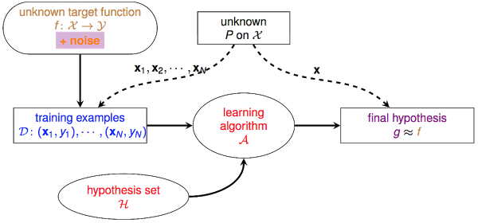
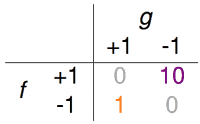
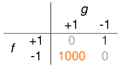

# 确定性 v.s 概率性 (deterministic v.s probabilistic)

&emsp;&emsp;让我们来回忆一下机器学习的基础架构：

&emsp;&emsp;

&emsp;&emsp;首先我们认为存在一个未知的真理 $f$，认为 $\mathcal{D}$中的$y$就是 $f$作用于$x$产生的，因此虽然无法直接得到 $f$，但若能找到一个和 $f$表现差不多的函数，也算是能学到东西。但在现实世界中，我们拿到的 $\mathcal{D}$并不是完美的，会有noise的存在，什么是noise呢？我们在用收音机听新闻的时候，往往会听到背景有个“沙沙”的声音，信号不好的时候，这种“沙沙”声会越来越大，这个“沙沙”声就是[noise](http://www.simplynoise.com/)。我们耳朵听到的是 $\mathcal{D}$(收音机放出来的东西)，我们希望通过 $\mathcal{D}$理解到 $f$(播音员真实要表达的)，这个noise就会干扰这个理解的过程， noise越大，我们就越难分辨播音员到底在说什么。在Learning中，noise主要表现为以下几种形式：

 - noise in y : 本来应该是圈圈的，却被标记为叉叉
 - noise in y : 输入$\mathcal{X}$完全相同的点，既有被标记圈圈的，也有被标记叉叉的
 - noise in x : 输入$\mathcal{X}$本身就存在问题，譬如100被写成了100万

&emsp;&emsp; $f$ 是一个“确定性”(deterministic)的模型，但$noise$是一个随机发生的东西，他们两个共同作用的结果，就成了一个“概率性”(probabilistic)的东西：

&emsp;&emsp;对于某个样本 $x$，理想状态下，应该有$y=f(x)=+1$，但由于某种noise的存在，该noise会有30%的概率会转换$f(x)$的结果(把+1变成-1或把-1变成+1)。因此在$\mathcal{D}$中，该样本有70%的概率表现出$y=+1$，30%的概率表现出$y=-1$.

&emsp;&emsp;再举个例子来对比下不考虑noise与考虑noise的情形有什么不同。假设不存在noise的情况下，某个hypothesis $h$在$\mathcal{D}$中的错误率$E\_{in}=\mu$。现在考虑加上一个 *'flipping' noise level* $=1-\lambda$的noise，即：

&emsp;&emsp;考虑到了noise，$h$判断正确的样本当中，实际只有$\lambda$这么多的比例是真的判断正确的，同理$h$判断错误的样本中，实际也只有$\lambda$这么多的比例是真的判断错误。假设$\mathcal{D}$中样本量为N：

&emsp;&emsp;因此，如果存在noise，则$h$判断错误的数量实际应该为$\lambda \mu N + (1-\lambda)(1-\mu)N$这么多，$h$真实的$E\_{in}=\lambda \mu + (1-\lambda)(1-\mu)$。稍微做个合并，得到：

$$\text{true  }E\_{in} = (2\lambda - 1)\mu + (1-\lambda)$$

&emsp;&emsp;假设通过学习我们得到一个$g$，并且有$E\_{in}(g)=0.2$(即$\mu = 0.2$)，若学习所用的$\mathcal{D}$中存在 *'flipping' level=0.1* 的noise(即$
\lambda = 0.9$)，则真实的$E\_{in}(g)=0.26$。若 *'flipping' level* 达到0.2，则真实的$E\_{in}(g) = 0.32$。可见noise的存在对learning是有一定影响的，在noise较大的情况下，算出的$E\_{in}$与真实的$E\_{in}$也会有很大的差别。因此想要学得好，$\mathcal{D}$的质量非常重要。

# 误差的衡量(Error Measure)

&emsp;&emsp;在把learning的工作交给机器的时候，必须让机器明白你学习的目标，譬如你想让什么什么最大化，或者什么什么最小化。通常的做法是把每一个预测值与真实值之间的误差(error)看成一种成本，机器要做的，就是在$\mathcal{H}$中，挑选一个能使总成本最低的函数。

&emsp;&emsp;之前提到的二元分类问题，就是对判断错误的点，记误差为1，判断正确的点，记误差为0：

&emsp;&emsp;不管是把$y=+1$的猜错成$-1$，或是把$y=-1$的猜错成$+1$，其产生的误差都为1。

&emsp;&emsp;在实际应用中，这个误差的定义可以很灵活，例如下面两个指纹验证的例子：

1. 超市利用指纹识别判断某个人是否是他们的会员，若是会员会给相应的折扣。这种情形下，可能做出两种不同的错误判断，把非会员错认为是会员，把会员错认为是非会员。但对于超市来说，这两种错误的成本应该是不同的。把非会员错认为是会员，无非损失些许的折扣；但若是把会员识别为非会员从而不给折扣，就会导致顾客的不满，从而损失掉了未来的生意。针对这种需求，或许下面这个error的衡量办法会更加合理一些。把+1(会员)错判为-1(非会员)的error为10，把-1错判为+1的error为1。

      
    (f代表真实值，g代表预测值)

2. 中情局的门禁系统，利用指纹判断是内部工作人员，才允许进入。这种情形下，若是把好人当坏人，代价并不高，无非就是请工作人员多按一次指纹的功夫，但如果把坏人当好人，损失可就大了。针对这种需求，下面这个error的衡量办法可能更加合理。

    
    
&emsp;&emsp;之前一直说的$E\_{in}(h)$，就是$h$作用于$\mathcal{D}$中每一笔数据，所产生的成本之和：

&emsp;&emsp;对于上面中情局的例子，$err(h,x\_n,y\_n)$的定义如下：

&emsp;&emsp;这种误差衡量方式称为"pointwise measure"，即对每个点记录误差，总误差为所有点产生的误差之和。在Ng那门课上，这个$E\_{in}(h)$被称为cost function，通过cost function可以计算出当前$h$作用于$\mathcal{D}$所造成的总成本，通过learning找到一个能够使总成本最小的$h$，就完成了学习的过程。

&emsp;&emsp;针对不同的问题与不同的使用环境，我们可以设计不同的误差衡量方法，下面是集中常见的误差的定义：

- 0/1 error ，通常用于分类问题：  
  $err(\widetilde{y},y)=[\widetilde{y}\neq y]$

- squared error，通常用于回归问题：  
  $err(\widetilde{y},y)=(\widetilde{y}-y)^2$

- absolute error：  
  $err(\widetilde{y},y)=abs(\widetilde{y}-y)$

&emsp;&emsp;总结一下，先根据问题的不同选择合适的误差衡量方式，0/1 error还是squared error或者是其他针对某一场景特殊设计的error？把$h$作用于$\mathcal{D}$中所有点的error加总起来就成了一个cost function，也就是$E\_{in}(h)$，接着要设计一个最优化算法$\mathcal{A}$，它能够从$\mathcal{H}$中挑选出能够使$E\_{in}$最小的方程$g$，learning就完成了。对于不同类型的cost function，通常会使用不同的最优化算法。对于某些cost function，很容易实现$E\_{in}$最小，比如之后会说的线性回归。对于某些cost function，寻找最小的$E\_{in}$是困难的，回忆之前说的[PLA](http://beader.me/2013/12/21/perceptron-learning-algorithm/)，用0/1 error来衡量误差，要minimize $E\_{in}$就是个NP Hard问题。

&emsp;&emsp;当然除此之外，cost function中还可以增加一些来自于error之外的成本，以达到限制模型复杂度方面的目的，如ridge regression、lasso等，这些以后有机会都会提到。
